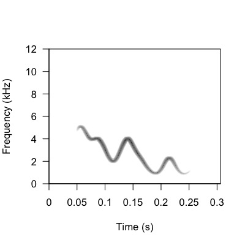
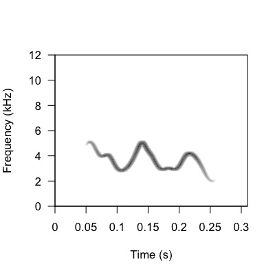
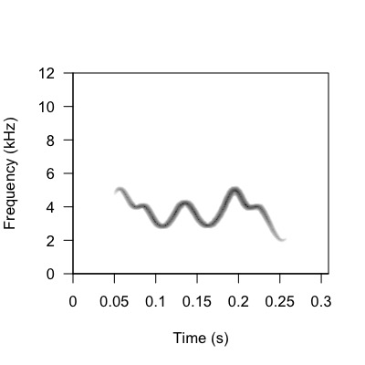
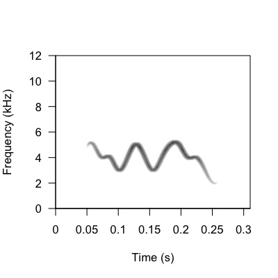

```{r setup, include = FALSE}

knitr::opts_chunk$set(echo = TRUE, eval = TRUE)

```

This vignette is very similar to Vignette 02 *BUT* with added steps exploring the effects of the two different `frequency_anchors` `section_transition` argument settings: "continuous_trajectory" and "starting_frequency".  In "starting_frequency" mode, the frequency value is reset to the `starting_frequency` value after each section. In "continuous_trajectory" mode, the frequency value is retained from the previous section. This means that using "continuous_trajectory" mode would make the ending frequency of the last section to influence the starting frequency of the following one; almost like a domino effect. On the other hand, using "starting_frequency" mode would force the beginning of each section to reset back to the starting_frequency value.

<h1>Set Up Working Environment</h1>

**Load packages and set path**

```{r message = FALSE, warning = FALSE, eval = TRUE, echo = TRUE}

# Clean the global environment
rm(list = ls())

# Specify the required packages
X <- c("devtools", "dplyr", "stringdist", "tidyverse", "ggplot2", "apcluster", "soundgen", "parallel", "stringr", "data.table", "tuneR", "pbapply", "warbleR", "magrittr")

# Install the packages in X if not already installed
is_installed <- function(p) is.element(p, installed.packages()[,1])

invisible(lapply(1:length(X), function(x){
  if(!is_installed(X[x])){
    install.packages(X[x], repos = "http://lib.stat.cmu.edu/R/CRAN")
  }
}))

# Install the paRsynth package from GitHub if you haven't installed it already
# devtools::install_github("gsvidaurre/paRsynth")

# Add paRsynth to the list of packages to load
# X <- c(X, "paRsynth")

# Change "Desktop/.../GitHub_repos" based on where paRsynth is stored on your local machine
# example
testing_path <- "~/Desktop/BIRDS/GitHub_repos/paRsynth/R"

# Load all of the packages specified above
invisible(lapply(X, library, character.only = TRUE))

```

**Initialize working directories for data on your local machine**

```{r message = FALSE, warning = FALSE, eval = TRUE, echo = TRUE}

# Initialize a base path (this will need to be different per user)
# example
path <- "/Users/gretheljuarez/Desktop/BIRDS/"

# Initialize the directory for analysis on your local computer
analysis_dir <- "paRsynth_frequency_anchors_settings_comparison"

# Combine the base path and the newly created data directory into a single path
analysis_path <- file.path(path, analysis_dir)

# Create the data directory if it doesn't already exist on your computer
if(!dir.exists(analysis_path)){ 
  dir.create(analysis_path)
}

# Specify a folder inside the analysis directory where audio will be written out/read in
audio_dir <- "audio"

# Combine the base path, the analysis directory, and the audio directory into a single path
audio_path <- file.path(path, analysis_dir, audio_dir)

# Create the audio directory if it doesn't already exist on your computer
if(!dir.exists(audio_path)){ 
  dir.create(audio_path)
}

# Specify a folder inside the analysis directory where images will be written out/read in
images_dir <- "images"

# Combine the base path, the analysis directory, and the data directory into a single path
images_path <- file.path(path, analysis_dir, images_dir)

# Create the data directory if it doesn't already exist on your computer
if(!dir.exists(images_path)){ 
  dir.create(images_path)
}

```

**Source the paRsynth functions directly from the GitHub repository**

```{r message = FALSE, warning = FALSE, eval = TRUE, echo = TRUE}
# Load the paRsynth functions that will be tested below
source(file.path(testing_path, "generate_strings.R"))
source(file.path(testing_path, "parsons_code.R"))
source(file.path(testing_path, "frequency_anchors.R"))
source(file.path(testing_path, "write_audio.R"))
```

<h1>paRsynth Workflow</h1>

**Step 1: Set parameters**  

```{r message = FALSE, warning = FALSE, eval = TRUE, echo = TRUE}

# Set the seed for reproducibility
set.seed(222)

# Initialize the values of group_information and individual_information, which correspond to the length of the string that will be allocated to encoding group membership or individual identity information
# Group information can outweigh individual information by a factor of at least 10 or higher
# Random variation should be at least half or more compared to individual information
individual_information <- 2
group_information <- 4
random_variation <- 2

# globals refers to the number of characters in the the head and tail shared among all calls in the dataset to bound the variation. Number input here is split in half and those amount of characters are allocated to head and tail of string
globals <- 8 # 4 characters for the global head, 4 for the global tail

# Calculate the string_length of the calls you will make by adding all the different segments of information
string_length <- group_information + individual_information + random_variation + globals

# Initialize the values of the number of groups, individuals, and calls
n_groups <- 5
n_individuals <- 10
n_calls <- 5

```

**Step 2: Create character strings representing vocal signals with more group membership information encoded within the call than individual identity information**

```{r message = FALSE, warning = FALSE, eval = TRUE, echo = TRUE}
### Generate the string for each call
calls <- generate_strings(
  n_groups = n_groups, 
  n_individuals = n_individuals, 
  n_calls = n_calls, 
  string_length = string_length, 
  group_information = group_information, 
  individual_information = individual_information,
  random_variation = random_variation
  )

dplyr::glimpse(calls)

```

**Step 3: Convert strings to Parsons code**

```{r message = FALSE, warning = FALSE, eval = TRUE, echo = TRUE}

calls_parsons <- parsons_code(
  df = calls, 
  string_col = "Call", 
  global_head_col = "Global_head",
  group_head_col = "Group_head",
  individual_middle_col = "Individual_middle",
  group_tail_col = "Group_tail",
  global_tail_col = "Global_tail",
  random_variation_col = "Random_variation",
  mapping = list("A" = "up", "B" = "down", "C" = "constant")
)

glimpse(calls_parsons)

```

**Step 4: Convert the Parsons code to frequency values**

From this step onward, two datasets will be made and used to explore the effects of the two different `frequency_anchors` arguments of `section_transition` = "continuous_trajectory" versus `section_transition` = "starting_frequency" on the spectrograms of the `paRsynth` generated calls.


**Dataset A**: `section_transition` = "continuous_trajectory"

```{r message = FALSE, warning = FALSE, eval = TRUE, echo = TRUE}

calls_parsons_frequencies_ct <- frequency_anchors(
  df = calls_parsons, 
  parsons_col = "Call_Parsons_Code", 
  group_id_col = "Group", 
  individual_id_col = "Individual", 
  call_id_col = "Call_ID", 
  call_string_col = "Call", 
  starting_frequency = 4000, 
  frequency_shift = 1000,
  section_transition = "continuous_trajectory" # This setting will be changed
  )

glimpse(calls_parsons_frequencies_ct)

```

**Dataset B**: `section_transition` = "starting_frequency"

```{r message = FALSE, warning = FALSE, eval = TRUE, echo = TRUE}

calls_parsons_frequencies_sf <- frequency_anchors(
  df = calls_parsons, 
  parsons_col = "Call_Parsons_Code", 
  group_id_col = "Group", 
  individual_id_col = "Individual", 
  call_id_col = "Call_ID", 
  call_string_col = "Call", 
  starting_frequency = 4000, 
  frequency_shift = 1000,
  section_transition = "starting_frequency" # This setting has been changed
  )

glimpse(calls_parsons_frequencies_sf)

```

Now we have two datasets created by two different frequency_anchors settings. We are going to create audio files for the calls to generate spectrograms for them to see how they differ.

**Step 5: For each call or string, use these frequency anchor vectors to generate synthetic audio files with the soundgen package**

**Dataset A**: `section_transition` = "continuous_trajectory"

```{r message = FALSE, warning = FALSE, eval = TRUE, echo = TRUE}

synthetic_call_metadata_ct <- write_audio(
  df = calls_parsons_frequencies_ct,
  save_path = audio_path, 
  sampling_rate = 44100,
  sylLen = 200,
  temperature = 0.025,  # default stochasticity in generating sound
  pitch_sampling_rate = 44100,
  smoothing = list(interpol = "loess", loessSpan = 1, discontThres = 0, jumpThres = 0),
  rolloffExact = c(0.25), # specify an amplitude value for the fundamental only, which will silence all harmonics
  formants = NA,
  vocalTract = NA,
  vibratoFreq = 1,
  prefix = "CT",
  invalidArgAction = "ignore"
  )

glimpse(synthetic_call_metadata_ct)

```

**Dataset B**: `section_transition` = "starting_frequency"

```{r message = FALSE, warning = FALSE, eval = TRUE, echo = TRUE}

synthetic_call_metadata_sf <- write_audio(
  df = calls_parsons_frequencies_sf,
  save_path = audio_path, 
  sampling_rate = 44100,
  sylLen = 200,
  temperature = 0.025,  # default stochasticity in generating sound
  pitch_sampling_rate = 44100,
  smoothing = list(interpol = "loess", loessSpan = 1, discontThres = 0, jumpThres = 0),
  rolloffExact = c(0.25), # specify an amplitude value for the fundamental only, which will silence all harmonics
  formants = NA,
  vocalTract = NA,
  vibratoFreq = 1,
  prefix = "SF",
  invalidArgAction = "ignore"
  )

glimpse(synthetic_call_metadata_sf)

```

**Step 6: Save the metadata for the synthetic audio files to a .CSV file**

**Dataset A**: `section_transition` = "continuous_trajectory"

```{r message = FALSE, warning = FALSE, eval = FALSE, echo = TRUE}

# Add extra metadata for upcoming image files names and rearrange columns
synthetic_call_metadata_ct %>%
  write.csv(., file = file.path(analysis_path, "synthetic_call_metadata_ct.csv"), row.names = FALSE) 

```

```{r message = FALSE, warning = FALSE, eval = FALSE, echo = TRUE}

synthetic_call_metadata_ct_csv <- read.csv(file.path(analysis_path, "synthetic_call_metadata_ct.csv"))

glimpse(synthetic_call_metadata_ct_csv)

```

**Dataset B**: `section_transition` = "starting_frequency"

```{r message = FALSE, warning = FALSE, eval = FALSE, echo = TRUE}

# Add extra metadata for upcoming image files names and rearrange columns
synthetic_call_metadata_sf %>%
  write.csv(., file = file.path(analysis_path, "synthetic_call_metadata_sf.csv"), row.names = FALSE) 

```

```{r message = FALSE, warning = FALSE, eval = FALSE, echo = TRUE}

synthetic_call_metadata_sf_csv <- read.csv(file.path(analysis_path, "synthetic_call_metadata_sf.csv"))

glimpse(synthetic_call_metadata_sf_csv)

```

You have generated two metadatas with paRsyth and it has been saved as a .CSV file for each argument setting!

**Step 7: Save the metadata for the synthetic datasets in a CSV file**

```{r message = FALSE, warning = FALSE, eval = FALSE, echo = TRUE}

# Combine the metdata across datasets and add an extra column to indicate the call dataset generated
synthetic_call_metadata_ct_csv %>%
  dplyr::mutate(
    dataset = "CT"
  ) %>% 
  bind_rows(
    synthetic_call_metadata_sf_csv %>% 
      dplyr::mutate(
        dataset = "SF"
      )
  ) %>%
  write.csv(., file = file.path(analysis_path, "synthetic_call_metadata.csv"), row.names = FALSE) 

synthetic_call_metadatacsv <- read.csv(file.path(analysis_path, "synthetic_call_metadata.csv"))

glimpse(synthetic_call_metadatacsv)

```

<h1>Bioacoustics Analysis Workflow</h1>

**Step 1: Create a warbleR selection table**

To organize all the `paRsynth` generated outputs you created in the previous vignettes, you will have to create a `warbleR` selection table. The `warbleR` package is very useful to streamline bioacoustic analysis. First you will list all the .WAV files and then organize them in a selection table.


```{r message = FALSE, warning = FALSE, eval = FALSE, echo = TRUE}

# Create a vector of all of the audio files in the analysis path
wavs <- list.files(path = audio_path, pattern = ".wav$", full.names = FALSE)
length(wavs)
head(wavs)
tail(wavs)

# Recall .csv file that has information from both datasets
synthetic_call_metadata <- read.csv(file.path(analysis_path, "synthetic_call_metadata.csv"))

# Iterate over the audio files to create one row of the selection table at a time. warbleR selection tables have a very specific format that must be used for downstream analysis.
sel_tbl <- data.table::rbindlist(pblapply(1:length(wavs), function(w){
  
  tmp <- tuneR::readWave(file.path(audio_path, wavs[w]))
  
  # Return the metadata for the given call using the synthetic metadata generated during audio file generation above
  metadats_tmp <- synthetic_call_metadata %>%
    dplyr::filter(grepl(wavs[w], audio_file_name))
  
  # Create a row for the selection table in warbleR format if the audio file exists and metadata for that file also exists
  if(nrow(metadats_tmp) > 0){
    
    # Use 0.1s as a margin to indicate where the vocalization starts and ends in the audio file
    # soundgen::soundgen() adds 100ms of silence before and after the synthetic vocalization by default 
    res <- data.frame(
      sound.files = wavs[w], 
      selec = 1,
      start = 0.1, 
      end = seewave::duration(tmp) - 0.1,
      sampling_rate = tmp@samp.rate,
      group_ID = metadats_tmp[["Group"]],
      individual_ID = metadats_tmp[["Individual"]],
      call = metadats_tmp[["Call"]],
      call_ID = metadats_tmp[["Call_ID"]],
      dataset = metadats_tmp[["dataset"]]
    )
    
  } else {
    
    res <- data.frame(
      sound.files = wavs[w], 
      selec = 1, 
      start = 0.1, 
      end = seewave::duration(tmp) + 0.1,
      sampling_rate = NA,
      group_ID = NA,
      individual_ID = NA,
      call = NA,
      call_ID = NA,
      dataset = NA
    )
    
  }
  
  return(res)
  
}))

# See the selection table in warbleR format with useful metadata for acoustic space plots
glimpse(sel_tbl)

# Check the selection table for all the unique sampling rates
unique(sel_tbl$sampling_rate)

```

This will output a neatly organized selection table of the uniquely generated vocalizations and their corresponding metadata.

**Step 2: Create spectrogram image files of each audio file**

Using the `warbleR` package, spectrograms can be created from each synthetic call you generated with `paRsynth`. A spectrogram is useful when analyzing vocalizations because it provides precise information on frequency over time. First, you will use `warbleR` to create spectrograms of the generated calls in the selection table. Then, you will rename the spectrogram files saved in your `images_path`.

**Dataset A**: `section_transition` = "continuous_trajectory"

```{r message = FALSE, warning = FALSE, eval = FALSE, echo = TRUE}

# To make spectrograms of dataset A (continuous_trajectory), you will need to filter it out from the selection table you made above.
ct_sel_tbl <- sel_tbl %>%
    dplyr::filter(grepl("CT", sound.files))

# Create spectrograms for filtered calls
warbleR::spectrograms(ct_sel_tbl, wl = 512, flim = c(0, 12), wn = "hanning", pal = reverse.gray.colors.2,ovlp = 90, inner.mar = c(5, 4, 4, 2), outer.mar = c(0, 0, 0, 0), picsize = 1, res = 100, cexlab = 1, propwidth = FALSE, xl = 1, osci = FALSE, gr = FALSE, sc = FALSE, line = FALSE, mar = 0.05, it = "jpeg", parallel = 1, path = audio_path, pb = TRUE, fast.spec = FALSE, by.song = NULL, sel.labels = NULL, title.labels = NULL, dest.path = images_path, box = TRUE, axis = TRUE)

# Rename the image files
imgs <- list.files(images_path)

new_nms <- gsub(".wav-1", "", imgs)

invisible(file.rename(file.path(images_path, imgs), file.path(images_path, new_nms)))

```

**Dataset B**: `section_transition` = "starting_frequency"

```{r message = FALSE, warning = FALSE, eval = FALSE, echo = TRUE}

# To make spectrograms of dataset B (starting_frequency), you will need to filter it out from the selection table you made above.
sf_sel_tbl <- sel_tbl %>%
    dplyr::filter(grepl("SF", sound.files))

# Create spectrograms for filtered calls
warbleR::spectrograms(sf_sel_tbl, wl = 512, flim = c(0, 12), wn = "hanning", pal = reverse.gray.colors.2,ovlp = 90, inner.mar = c(5, 4, 4, 2), outer.mar = c(0, 0, 0, 0), picsize = 1, res = 100, cexlab = 1, propwidth = FALSE, xl = 1, osci = FALSE, gr = FALSE, sc = FALSE, line = FALSE, mar = 0.05, it = "jpeg", parallel = 1, path = audio_path, pb = TRUE, fast.spec = FALSE, by.song = NULL, sel.labels = NULL, title.labels = NULL, dest.path = images_path, box = TRUE, axis = TRUE)

# Rename the image files
imgs <- list.files(images_path)

new_nms <- gsub(".wav-1", "", imgs)

invisible(file.rename(file.path(images_path, imgs), file.path(images_path, new_nms)))

```

This will output appropriately named spectrograms for the synthetically generated calls in the selection table created previously.

<h1>Comparing spectrograms of calls made with different frequency_anchors setting (continuous_trajectory versus starting_frequency)</h1>


|   
| <b><i>continuous_trajectory</i>_Group1_Individual1_Call1</b> side by side comparison to <b><i>starting_frequency</i>_Group1_Individual1_Call1 </b>

|  
| <b><i>continuous_trajectory</i>_Group2_Individual5_Call2</b> side by side comparison to <b><i>starting_frequency</i>_Group2_Individual5_Call2</b> 

<br>
The figure above compares two pairs of calls created with different frequency anchors settings. Dataset A was made with `section_transition` = "continuous_trajectory". Dataset B was made with `section_transition` = "starting_frequency". Starting from left to right, top to bottom of the spectrograms, A_Group1_Indiv1_Call1 versus B_Group1_Indiv1_Call1 and A_Group2_Indiv5_Call2 versus B_Group2_Indiv5_Call2.

Once you have decided which frequency anchor setting is best for your project, navigate to Vignette 03: Bioacoustics Analysis to learn how to analyze these outputs you created with paRsynth.
