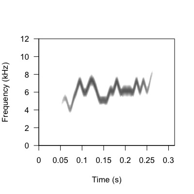
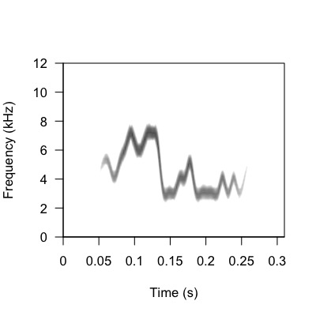
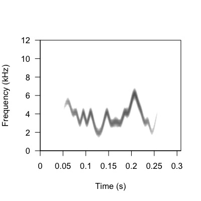
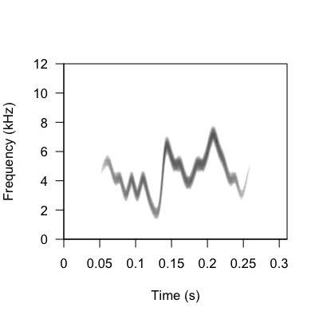

```{r setup, include = FALSE}

knitr::opts_chunk$set(echo = TRUE, eval = TRUE)

```

This vigentte is very similar to Vignette 02 BUT with added steps exploring the effects of the two different frequency_anchors settings: continuous_trajectory and starting_frequency.

<h1>Set Up Working Environment</h1>

Before using the functions in the paRsynth package, there are some preliminary steps we must go through to create a directory where different types of generated data can be automatically stored (audios and images). This automatic organization of generated data will make it easier to streamline the process of using paRsynth's functions.

**Load packages and set path**

It is good practice to clean your global environment before using functions from open-sourced packages. In order for paRsynth functions to run, they need specific external R packages as well. For example, 'write_audio' generates and saves audio files in .wav format which requires the package `soundgen::soundgen()` to be installed and loaded. 

```{r message = FALSE, warning = FALSE}

# Clean the global environment
rm(list = ls())

# Specify the required packages
X <- c("devtools", "dplyr", "stringdist", "tidyverse", "ggplot2", "apcluster", "soundgen", "parallel", "stringr", "data.table", "tuneR", "pbapply", "warbleR", "magrittr")

# Install the packages in X if not already installed
is_installed <- function(p) is.element(p, installed.packages()[,1])

invisible(lapply(1:length(X), function(x){
  if(!is_installed(X[x])){
    install.packages(X[x], repos = "http://lib.stat.cmu.edu/R/CRAN")
  }
}))

# Install the paRsynth package from GitHub if you haven't installed it already
# devtools::install_github("gsvidaurre/paRsynth")

# Add paRsynth to the list of packages to load
# X <- c(X, "paRsynth")

# Change "Desktop/.../GitHub_repos" based on where paRsynth is stored on your local machine
# testing_path <- "C://Users/summe/OneDrive/Desktop/github_repo/paRsynth/R/" # Summer's testing path
testing_path <- "~/Desktop/BIRDS/GitHub_repos/paRsynth/R" # Alexandra's testing path

# Load all of the packages specified above
invisible(lapply(X, library, character.only = TRUE))

```

**Initialize working directories for data on your local machine**

It is important to have your files organized, especially when creating many different types of output data (audios and images). Therefore, initializing working directories in the beginning will be helpful in understanding the data you create with paRsynth and where they are stored.

```{r}

# Initialize a base path (this will need to be different per user)
# path <- "/Users/raneemsamman/Desktop" # Raneem's path
# path <- "/Users/gracesmith-vidaurre/Desktop" # Grace's path
path <- "/Users/gretheljuarez/Desktop/BIRDS/" # Alexandra's path
# path <- "/Users/summe/OneDrive/Desktop/" # Summer's path

# Initialize the directory for analysis on your local computer
analysis_dir <- "paRsynth_frequency_anchors_settings_comparison"

# Combine the base path and the newly created data directory into a single path
analysis_path <- file.path(path, analysis_dir)

# Create the data directory if it doesn't already exist on your computer
if(!dir.exists(analysis_path)){ 
  dir.create(analysis_path)
}

# Specify a folder inside the analysis directory where audio will be written out/read in
audio_dir <- "audio"

# Combine the base path, the analysis directory, and the audio directory into a single path
audio_path <- file.path(path, analysis_dir, audio_dir)

# Create the audio directory if it doesn't already exist on your computer
if(!dir.exists(audio_path)){ 
  dir.create(audio_path)
}

# Specify a folder inside the analysis directory where images will be written out/read in
images_dir <- "images"

# Combine the base path, the analysis directory, and the data directory into a single path
images_path <- file.path(path, analysis_dir, images_dir)

# Create the data directory if it doesn't already exist on your computer
if(!dir.exists(images_path)){ 
  dir.create(images_path)
}

```

**Source the paRsynth functions directly from the GitHub repository**

In order to use the paRsynth functions, you will need to source them into your enviornment. 

```{r}
# Load the paRsynth functions that will be tested below
source(file.path(testing_path, "generate_strings.R"))
source(file.path(testing_path, "parsons_code.R"))
source(file.path(testing_path, "frequency_anchors.R"))
source(file.path(testing_path, "write_audio.R"))
```

**Check out documentation for the paRsynth functions. These functions are written below in the order in which they should be used**

Before using the paRsynth package, it would be beneficial for you to go over the description, usage, arguments, extra details, and examples of each function. 

```{r eval = FALSE}

?paRsynth::generate_strings
?paRsynth::parsons_code
?paRsynth::frequency_anchors
?paRsynth::write_audio

```

<h1>paRsynth Workflow</h1>

**Step 1: Set parameters**

After installing paRsynth and loading the relevant libraries, you will be able to take the first step of setting the parameters of the synthetic bird calls you will generate with paRsynth.  

```{r}

# Set the seed for reproducibility
set.seed(2)

# Initialize the values of group_information and individual_information, which correspond to the length of the string that will be allocated to encoding group membership or individual identity information
# Group information can outweigh individual information by a factor of at least 10 or higher
# Random variation should be at least half or more compared to individual information
factor_ratio <- 4
individual_information <- 4
group_information <- individual_information * factor_ratio

# Create variation within individuals
random_variation <- 2

# Initialize the values of the number of groups, individuals, and calls
n_groups <- 2
n_individuals <- 5
n_calls <- 2

# globals refers to the number of characters in the the head and tail shared among all calls in the dataset to bound the variation. Number input here is split in half and those amount of characters are allocated to head and tail of string
globals <- 8 # 4 characters for the global head, 4 for the global tail
string_length <- (group_information + individual_information) + globals
```

**Step 2: Create character strings representing vocal signals with more group membership information encoded within the call than individual identity information**

The second step is generating the character strings that represent vocalizations using the function generate_strings(). These strings encode both group membership (characters that are shared across individuals within a group) and individual identity (characters that are unique to each individual in a group). The function allows you to specify the length of the string as well as how much of the string encodes group versus individual identity information. It also allows you to control the number of groups, individuals in each group and calls per individual. These variables that you can control are known as the parameters of the function.

```{r}
### Generate the string for each call
calls <- generate_strings(
  n_groups = n_groups, 
  n_individuals = n_individuals, 
  n_calls = n_calls, 
  string_length = string_length, 
  group_information = group_information, 
  individual_information = individual_information,
  random_variation = random_variation
  )

dplyr::glimpse(calls)

```

The above chunk of code will generate a data frame called calls. Each row of the data frame represents a call, including the group, individual, and call identifiers, along with the vocalization string itself. 

**Step 3: Convert strings to Parsons code**

Now that you have a data frame of generated calls, you can use the parsons_code() function to convert the vocalization strings in the data frame example_calls into Parsons code. The goal of this step is to create a representation of the direction of frequency shifts ("up", "down", "constant") that will be used to modulate the sound's pitch when generating synthetic audio later on. This function has 3 parameters: the data frame (df), the name of the column containing the character strings (string_col), and the list that maps each character ("A", "B", "C") to a direction in Parsons code ("up", "down", "constant") (mapping).

```{r}

calls_parsons <- parsons_code(
  df = calls, 
  string_col = "Call", 
  global_head_col = "Global_head",
  group_head_col = "Group_head",
  individual_middle_col = "Individual_middle",
  group_tail_col = "Group_tail",
  global_tail_col = "Global_tail",
  random_variation_col = "Random_variation",
  mapping = list("A" = "up", "B" = "down", "C" = "constant")
)

glimpse(calls_parsons)

```

This will return a data frame with all the previous columns in example_calls in addition to one extra column called "Parsons_code", which contains the Parsons code representation of each segment of the vocalization string.

**Step 4: Convert the Parsons code to frequency values**

With the Parsons code in your data frame, you are now able to use the frequency_anchors() function to create frequency anchors that will guide the changes in pitch when creating synthetic audio files. Starting at a baseline frequency value, frequency values are calculated for each sequential character of the string using the Parsons code from the previous step. Therefore, the parameters of this function are the data frame with the parsons code, the names of the columns containing the parsons code (parsons_col), the numeric group identifiers (group_id_col), the numeric individual identifiers (individual_id_col), unique numeric identifiers for each vocalization per individual (call_id_col),  the character string per vocalization (call_string_col), the baseline frequency value (starting_frequency) which has a default of 4000 Hz, and a value of frequency shift (frequency_shift) which has a default value of 1000. 

From this step onward, two datasets will be made and used to explore the effects of the two different frequency_anchors setting of section_transition = "continuous_trajectory" versus section_transition = "starting_frequency" on the spectrograms of the paRsynth generated calls.


**Dataset A**: section_transition = "continuous_trajectory"

```{r}

calls_parsons_frequencies_cf <- frequency_anchors(
  df = calls_parsons, 
  parsons_col = "Call_Parsons_Code", 
  group_id_col = "Group", 
  individual_id_col = "Individual", 
  call_id_col = "Call_ID", 
  call_string_col = "Call", 
  starting_frequency = 4000, 
  frequency_shift = 1000,
  section_transition = "continuous_trajectory" # This setting will be changed
  )

glimpse(calls_parsons_frequencies_cf)

```

**Dataset B**: section_transition = "starting_frequency"

```{r}

calls_parsons_frequencies_sf <- frequency_anchors(
  df = calls_parsons, 
  parsons_col = "Call_Parsons_Code", 
  group_id_col = "Group", 
  individual_id_col = "Individual", 
  call_id_col = "Call_ID", 
  call_string_col = "Call", 
  starting_frequency = 4000, 
  frequency_shift = 1000,
  section_transition = "starting_frequency" # This setting has been changed
  )

glimpse(calls_parsons_frequencies_sf)

```


This will return updated data frames that includes all of the previous columns in addition to new columns that represent each frequency anchor for each vocalization (the number of columns added in this step corresponds to the character length of your vocalization string).

Now we have two datasets created by two different frequency_anchors settings. We are going to create calls and spectrograms for them to see how they differ.

**Step 5: For each call or string, use these frequency anchor vectors to generate synthetic audio files with the soundgen package**

Now, finally, you are equipped with all the necessary data to generate the audio files that will allow you to hear the synthetic bird calls we generated! To do that, we will use the function write_audio(). This function creates a sound file (in .wav format) for each vocalization and saves it to your desired directory. Each file will represent one vocalization with its own unique frequency modulation pattern that was developed in step 3. This function has five parameters: the data frame with frequency anchors and string metadata (df), the directory where the audio files will be saved (save_path), the sampling rate for the audio files with a default of 150000 Hz (sampling_rate), the length of the syllable in milliseconds with a default of 200 ms (sylLen), and the prefix for the audio file names (prefix). Note that the prefix you use for the synthetic audio files should match the social level that should contain the most information (here it is the group level because the group information string is longer).

**Dataset A**: section_transition = "continuous_trajectory"

```{r eval=FALSE}

synthetic_call_metadata_cf <- write_audio(
  df = calls_parsons_frequencies_cf,
  save_path = audio_path, 
  sampling_rate = 150000,
  sylLen = 200,
  temperature = 0.025,  # default stochasticity in generating sound
  pitch_sampling_rate = 44100,
  smoothing = list(interpol = "loess", loessSpan = 1, discontThres = 0, jumpThres = 0),
  rolloffExact = c(0.25), # specify an amplitude value for the fundamental only, which will silence all harmonics
  formants = NA,
  vocalTract = NA,
  vibratoFreq = 1,
  prefix = "A",
  invalidArgAction = "ignore"
  )

glimpse(synthetic_call_metadata_cf)

```

**Dataset B**: section_transition = "starting_frequency"

```{r eval=FALSE}

synthetic_call_metadata_sf <- write_audio(
  df = calls_parsons_frequencies_sf,
  save_path = audio_path, 
  sampling_rate = 150000,
  sylLen = 200,
  temperature = 0.025,  # default stochasticity in generating sound
  pitch_sampling_rate = 44100,
  smoothing = list(interpol = "loess", loessSpan = 1, discontThres = 0, jumpThres = 0),
  rolloffExact = c(0.25), # specify an amplitude value for the fundamental only, which will silence all harmonics
  formants = NA,
  vocalTract = NA,
  vibratoFreq = 1,
  prefix = "B",
  invalidArgAction = "ignore"
  )

glimpse(synthetic_call_metadata_sf)

```

This will create files with the extension .wav for each vocalization and will save them in your desired and specified directory with a prefix of your preference.

**Step 6: Save the metadata for the synthetic audio files to a CSV file**

The data frames that you generate in R using paRsynth can be saved as physical files in your working directory. You can also save your paRsynth generated metadata into a CSV file. I recommend using this file type since it is compatible with R, Microsoft Word, and other software. You can use the function `write.csv()` to save data frames to .csv spreadsheets on your computer:

**Dataset A**: section_transition = "continuous_trajectory"

```{r eval = FALSE}

# Add extra metadata for upcoming image files names and rearrange columns
synthetic_call_metadata_cf %>%
  write.csv(., file = file.path(analysis_path, "synthetic_call_metadata_cf.csv"), row.names = FALSE) 

```

```{r}

synthetic_call_metadata_cf_csv <- read.csv(file.path(analysis_path, "synthetic_call_metadata_cf.csv"))

glimpse(synthetic_call_metadata_cf_csv)

```

**Dataset B**: section_transition = "starting_frequency"

```{r eval = FALSE}

# Add extra metadata for upcoming image files names and rearrange columns
synthetic_call_metadata_sf %>%
  write.csv(., file = file.path(analysis_path, "synthetic_call_metadata_sf.csv"), row.names = FALSE) 

```

```{r}

synthetic_call_metadata_sf_csv <- read.csv(file.path(analysis_path, "synthetic_call_metadata_sf.csv"))

glimpse(synthetic_call_metadata_sf_csv)

```

You have generated two metadatas with paRsyth and it has been saved as a CSV file!

**Step 7: Save the metadata for the synthetic datasets in a CSV file**

It may be beneficial to have a single csv file that combine information from both datasets.

```{r}

# Combine the metdata across datasets and add an extra column to indicate the call dataset generated
synthetic_call_metadata_cf_csv %>%
  dplyr::mutate(
    dataset = "A"
  ) %>% 
  bind_rows(
    synthetic_call_metadata_sf_csv %>% 
      dplyr::mutate(
        dataset = "B"
      )
  ) %>%
  write.csv(., file = file.path(analysis_path, "synthetic_call_metadata.csv"), row.names = FALSE) 

```

After running this code you will have two datasets each with a single .csv file that includes all the details of the synthetic identity signals you generated with paRsynth in this vignette. 1) reflects vocalizations created with continuous_trajectory setting and 2) vocalizations created with starting_frequency setting. Now we are ready to do some Bioacoustics Analysis steps to analyze and compare these outputs you created with paRsynth.

<h1>Bioacoustics Analysis Workflow</h1>

**Step 1: Create a warbleR selection table**

To organize all the paRsynth generated outputs you created in the previous vignettes, you will have to create a warbleR selection table. The warbleR package is very useful to streamline bioacustics analysis. First you will list all the .wav files and then organize them in a selection table.


```{r}

# Create a vector of all of the audio files in the analysis path
wavs <- list.files(path = audio_path, pattern = ".wav$", full.names = FALSE)
length(wavs)
head(wavs)
tail(wavs)

# Recall .csv file that has information from both datasets
synthetic_call_metadata <- read.csv(file.path(analysis_path, "synthetic_call_metadata.csv"))

# Iterate over the audio files to create one row of the selection table at a time. warbleR selection tables have a very specific format that must be used for downstream analysis.
sel_tbl <- data.table::rbindlist(pblapply(1:length(wavs), function(w){
  
  tmp <- tuneR::readWave(file.path(audio_path, wavs[w]))
  
  # Return the metadata for the given call using the synthetic metadata generated during audio file generation above
  metadats_tmp <- synthetic_call_metadata %>%
    dplyr::filter(grepl(wavs[w], audio_file_name))
  
  # Create a row for the selection table in warbleR format if the audio file exists and metadata for that file also exists
  if(nrow(metadats_tmp) > 0){
    
    # Use 0.1s as a margin to indicate where the vocalization starts and ends in the audio file
    # soundgen::soundgen() adds 100ms of silence before and after the synthetic vocalization by default 
    res <- data.frame(
      sound.files = wavs[w], 
      selec = 1,
      start = 0.1, 
      end = seewave::duration(tmp) - 0.1,
      sampling_rate = tmp@samp.rate,
      group_ID = metadats_tmp[["Group"]],
      individual_ID = metadats_tmp[["Individual"]],
      call = metadats_tmp[["Call"]],
      call_ID = metadats_tmp[["Call_ID"]],
      dataset = metadats_tmp[["dataset"]]
    )
    
  } else {
    
    res <- data.frame(
      sound.files = wavs[w], 
      selec = 1, 
      start = 0.1, 
      end = seewave::duration(tmp) + 0.1,
      sampling_rate = NA,
      group_ID = NA,
      individual_ID = NA,
      call = NA,
      call_ID = NA,
      dataset = NA
    )
    
  }
  
  return(res)
  
}))

# See the selection table in warbleR format with useful metadata for acoustic space plots
glimpse(sel_tbl)

# Check the selection table for all the unique sampling rates
unique(sel_tbl$sampling_rate)

```

This will output a neatly organized selection table of the uniquely generated vocalizations and their corresponding metadata.

**Step 2: Create spectrogram image files of each audio file**

Using the warbleR package, spectrogram images can be created from each synthetic vocalization you generated with paRsynth. Using a spectrogram is beneficial to analyze vocalizations because it provides precise information on frequency over time. First, you will use warbleR to create spectrograms of the generated vocalization in the selection table. Then you will rename the spectrogram image files saved in your images_path. 

In the following example, we are creating spectrograms for the first dataset we created, where more group information is encoded in the vocalization than individual identity information.

**Dataset A**: section_transition = "continuous_trajectory"

```{r eval=FALSE}

# To make spectrograms of dataset A (continuous_trajectory), you will need to filter it out from the selection table you made above.
A_sel_tbl <- sel_tbl %>%
    dplyr::filter(grepl("A", sound.files))

# Create spectrograms for filtered calls
warbleR::spectrograms(A_sel_tbl, wl = 512, flim = c(0, 12), wn = "hanning", pal = reverse.gray.colors.2,ovlp = 90, inner.mar = c(5, 4, 4, 2), outer.mar = c(0, 0, 0, 0), picsize = 1, res = 100, cexlab = 1, propwidth = FALSE, xl = 1, osci = FALSE, gr = FALSE, sc = FALSE, line = FALSE, mar = 0.05, it = "jpeg", parallel = 1, path = audio_path, pb = TRUE, fast.spec = FALSE, by.song = NULL, sel.labels = NULL, title.labels = NULL, dest.path = images_path, box = TRUE, axis = TRUE)

# Rename the image files
imgs <- list.files(images_path)

new_nms <- gsub(".wav-1", "", imgs)

invisible(file.rename(file.path(images_path, imgs), file.path(images_path, new_nms)))

```

**Dataset B**: section_transition = "starting_frequency"

```{r eval=FALSE}

# To make spectrograms of dataset B (starting_frequency), you will need to filter it out from the selection table you made above.
B_sel_tbl <- sel_tbl %>%
    dplyr::filter(grepl("B", sound.files))

# Create spectrograms for filtered calls
warbleR::spectrograms(B_sel_tbl, wl = 512, flim = c(0, 12), wn = "hanning", pal = reverse.gray.colors.2,ovlp = 90, inner.mar = c(5, 4, 4, 2), outer.mar = c(0, 0, 0, 0), picsize = 1, res = 100, cexlab = 1, propwidth = FALSE, xl = 1, osci = FALSE, gr = FALSE, sc = FALSE, line = FALSE, mar = 0.05, it = "jpeg", parallel = 1, path = audio_path, pb = TRUE, fast.spec = FALSE, by.song = NULL, sel.labels = NULL, title.labels = NULL, dest.path = images_path, box = TRUE, axis = TRUE)

# Rename the image files
imgs <- list.files(images_path)

new_nms <- gsub(".wav-1", "", imgs)

invisible(file.rename(file.path(images_path, imgs), file.path(images_path, new_nms)))

```

This will output appropriately named spectrograms for the synthetically generated vocalizations in the selection table created previously.

<h1>Comparing spectrograms of calls made with different frequency_anchors setting (continuous_trajectory versus starting_frequency)</h1>


|   
| <b><i>continuous_trajectory</i>_Group1_Individual1_Call1</b> side by side comparison to <b><i>starting_frequency</i>_Group1_Individual1_Call1 </b>

|  
| <b><i>continuous_trajectory</i>_Group2_Individual5_Call2</b> side by side comparison to <b><i>starting_frequency</i>_Group2_Individual5_Call2<b> 

<br>
The figure above compares two pairs of calls created with different frequency anchors settings. Dataset A was made with section_transition = "continuous_trajectory". Dataset B was made with section_transition = "starting_frequency". Starting from left to right, top to bottom of the spectrograms, A_Group1_Indiv1_Call1 versus B_Group1_Indiv1_Call1 and A_Group2_Indiv5_Call2 versus B_Group2_Indiv5_Call2.

Once you have decided which frequency anchor setting is best for your project, navigate to Vignette 03: Bioacoustics Analysis to learn how to analyze these outputs you created with paRsynth.
