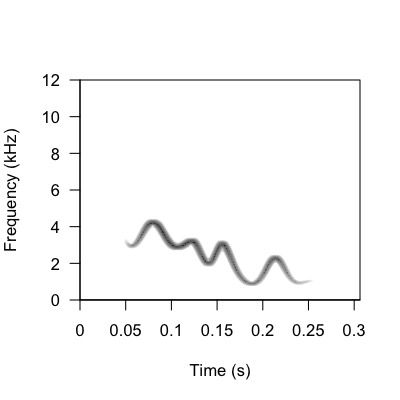

```{r setup, include=FALSE}
knitr::opts_chunk$set(echo = TRUE, collapse = TRUE)
```

In this vignette, we will go through how to analyze the synthetic identity signals you generated using the `paRsynth` package in vignette 02 by creating spectrograms and acoustic space plots to analyze their acoustic similarities.

<h1>Set Up Working Environment</h1>

Before using the `paRsynth` functions, there are some preliminary steps we must go through to create a directory where different types of generated data can be automatically stored (audios and images). This automatic organization of generated data will make it easier to streamline the process of using the `paRsynth` functions.

**Re-load packages and reset path**

It is good practice to clean your global environment before using functions from open-sourced packages. In order for the `paRsynth` functions to run, they need specific external R packages as well. For example, `write_audio` generates and saves audio files in .WAV format which requires the package `soundgen` to be installed and loaded.  

```{r message = FALSE, warning = FALSE}

# Clean the global environment
rm(list = ls())

# Specify the required packages
X <- c("devtools", "dplyr", "stringdist", "tidyverse", "ggplot2", "apcluster", "soundgen", "parallel", "stringr", "data.table", "tuneR", "pbapply", "warbleR", "magrittr")

# Install the packages in X if not already installed
is_installed <- function(p) is.element(p, installed.packages()[,1])

invisible(lapply(1:length(X), function(x){
  if(!is_installed(X[x])){
    install.packages(X[x], repos = "http://lib.stat.cmu.edu/R/CRAN")
  }
}))

# Install the paRsynth package from GitHub if you haven't installed it already
devtools::install_github("gsvidaurre/paRsynth")

# Add paRsynth to the list of packages to load
X <- c(X, "paRsynth")

# Change "Desktop/.../GitHub_repos" to where paRsynth is stored on your local machine
testing_path <- "~/Desktop/BIRDS/GitHub_repos/paRsynth/R" # example

# Load all of the packages specified above
invisible(lapply(X, library, character.only = TRUE))

```

**Re-initialize working directories for data on your local machine**

It is important to have your files organized, especially when creating many different types of output data (audios and images). Therefore, initializing working directories in the beginning will be helpful in understanding the data you create with `paRsynth` and where they get stored.

```{r}

# Initialize a base path (this will need to be different per user)
# example
path <- "/Users/raneemsamman/Desktop/BIRDS/"

# Initialize the directory for analysis on your local computer
analysis_dir <- "paRsynth_methods_synthetic_dataset"

# Combine the base path and the newly created data directory into a single path
analysis_path <- file.path(path, analysis_dir)

# Create the data directory if it doesn't already exist on your computer
if(!dir.exists(analysis_path)){ 
  dir.create(analysis_path)
}

# Specify a folder inside the analysis directory where audio will be written out/read in
audio_dir <- "audio"

# Combine the base path, the analysis directory, and the audio directory into a single path
audio_path <- file.path(path, analysis_dir, audio_dir)

# Create the audio directory if it doesn't already exist on your computer
if(!dir.exists(audio_path)){ 
  dir.create(audio_path)
}

# Specify a folder inside the analysis directory where images will be written out/read in
images_dir <- "images"

# Combine the base path, the analysis directory, and the data directory into a single path
images_path <- file.path(path, analysis_dir, images_dir)

# Create the data directory if it doesn't already exist on your computer
if(!dir.exists(images_path)){ 
  dir.create(images_path)
}

# Specify a folder inside the analysis directory where images for figures will be written out/read in
figures_dir <- "figures"

# Combine the base path, the analysis directory, and the data directory into a single path
figures_path <- file.path(path, analysis_dir, figures_dir)

# Create the data directory if it doesn't already exist on your computer
if(!dir.exists(figures_path)){ 
  dir.create(figures_path)
}

```

**Read in the synthetic call metadata and set cores for parallel processing**

For vignette 3 to run it will need to read in the metadata collected in a .CSV file that you created in vignette 2. By setting your cores for parallel processing, this will make running this code more streamlined and attain results faster.

```{r}

synthetic_call_metadata <- read.csv(file.path(analysis_path, "synthetic_call_metadata.csv"))
glimpse(synthetic_call_metadata)

# Remove NAs
synthetic_call_metadata_clean <- na.omit(synthetic_call_metadata)

cores <- parallel::detectCores() - 4
cores

# Find the maximum frequency anchor value across all vocalizations
freq_cols <- synthetic_call_metadata_clean[, grepl("Frequency", names(synthetic_call_metadata))]
glimpse(freq_cols)

max_freq <- max(sapply(freq_cols, max))
max_freq

```

<h1>Bioacoustics Analysis Workflow</h1>

**Step 1: Create a warbleR selection table**

To organize all the paRsynth generated outputs you created in the previous vignettes, you will have to create a selection table using `warbleR`. This package is very useful to streamline bioacustics analysis. First you will list all the .WAV files and then organize them in a selection table.

```{r}

# Create a vector of all of the audio files in the analysis path
wavs <- list.files(path = audio_path, pattern = ".wav$", full.names = FALSE)
length(wavs)
head(wavs)
tail(wavs)

# Iterate over the audio files to create one row of the selection table at a time. warbleR selection tables have a very specific format that must be used for downstream analysis.
sel_tbl <- data.table::rbindlist(pblapply(1:length(wavs), function(w){
  
  tmp <- tuneR::readWave(file.path(audio_path, wavs[w]))
  
  # Return the metadata for the given call using the synthetic metadata generated during audio file generation above
  metadats_tmp <- synthetic_call_metadata %>%
    dplyr::filter(grepl(wavs[w], audio_file_name))
  
  # Create a row for the selection table in warbleR format if the audio file exists and metadata for that file also exists
  if(nrow(metadats_tmp) > 0){
    
    # Use 0.1s as a margin to indicate where the vocalization starts and ends in the audio file
    # soundgen::soundgen() adds 100ms of silence before and after the synthetic vocalization by default 
    res <- data.frame(
      sound.files = wavs[w], 
      selec = 1,
      start = 0.1, 
      end = seewave::duration(tmp) - 0.1,
      sampling_rate = tmp@samp.rate,
      group_ID = metadats_tmp[["Group"]],
      individual_ID = metadats_tmp[["Individual"]],
      call = metadats_tmp[["Call"]],
      call_ID = metadats_tmp[["Call_ID"]],
      dataset = metadats_tmp[["dataset"]]
    )
    
  } else {
    
    res <- data.frame(
      sound.files = wavs[w], 
      selec = 1, 
      start = 0.1, 
      end = seewave::duration(tmp) + 0.1,
      sampling_rate = NA,
      group_ID = NA,
      individual_ID = NA,
      call = NA,
      call_ID = NA,
      dataset = NA
    )
    
  }
  
  return(res)
  
}))

# See the selection table in warbleR format with useful metadata for acoustic space plots
view(sel_tbl)

# Check the selection table for all the unique sampling rates
unique(sel_tbl$sampling_rate)

```

This will output a neatly organized selection table of the uniquely generated calls and their corresponding metadata.

**Step 2: Create spectrogram image files of each audio file**

Using the `warbleR` package, spectrograms can be created from each synthetic identity signals you generated with `paRsynth`. Using a spectrogram is beneficial to analyze vocalizations because it provides precise information on its frequency over time. First, you will use `warbleR` to create spectrograms of the generated calls in the selection table you made in the previous step. Then you will rename the spectrogram files saved in your designated directory. 

In the following example, we are creating spectrograms from the first dataset we created, where more group information is encoded in the call than individual identity information.

```{r}

# To make spectrograms of dataset 1 (more group info), you will need to filter it out from the selection table you made above.
GroupMembership_sel_tbl <- sel_tbl %>%
    dplyr::filter(grepl("GroupMembership", sound.files))
GroupMembership_sel_tbl
# Create spectrograms for filtered calls
warbleR::spectrograms(GroupMembership_sel_tbl, wl = 512, flim = c(0, 12), wn = "hanning", pal = reverse.gray.colors.2,ovlp = 90, inner.mar = c(5, 4, 4, 2), outer.mar = c(0, 0, 0, 0), picsize = 1, res = 100, cexlab = 1, propwidth = FALSE, xl = 1, osci = FALSE, gr = FALSE, sc = FALSE, line = FALSE, mar = 0.05, it = "jpeg", parallel = 1, path = audio_path, pb = TRUE, fast.spec = FALSE, by.song = NULL, sel.labels = NULL, title.labels = NULL, dest.path = images_path, box = TRUE, axis = TRUE)

# Rename the image files
imgs <- list.files(images_path)

new_nms <- gsub(".wav-1", "", imgs)

invisible(file.rename(file.path(images_path, imgs), file.path(images_path, new_nms)))

```

This will output appropriately named spectrograms for the synthetically generated vocalizations in the selection table created previously. Refer to the image below for an example of a spectrogram (GroupMembership_Group1_Ind1_Call1).



<br>

**Step 3: Perform spectrogrphic cross-correlation (SPCC) to measure acoustic similarity of all calls in dataset (pairwise similarity matrix)**

Now, we are getting to the key analysis step. By using the spectrograms created using the `warbleR` package, spectrographic cross-correlation (SPCC) can be performed to find acoustic similarities between each spectrogram created to the others in the same dataset. The output is a single similarity measurement for every unique vocalization compared to the dataset. 

If the `temperature` argument used by `soundgen` is set to 0 (for no stochasticity in sound generation), then you will need to filter out any calls that have duplicated strings prior to running cross-correlation. Otherwise you will have values of 1 outside of the diagonal representing comparisons among calls of exactly the same structure or duplicates, and multidimensional scaling will fail.


```{r}

# Perform SPCC to measure acoustic similarity of all calls in dataset GroupMembership_sel_tbl
# When generating the synthetic vocalizations, increasing the temperature from 0 to 0.025 reduced the number of ones off of the diagonal to 1. I just increased temperature to 0.05 and there was still a single 1 off of the diagonal
# (max_freq/1000): The maximum frequency in the bandwidth argument was 7 kHz, add 2 kHz for a buffer
xc_mat <- warbleR::cross_correlation(GroupMembership_sel_tbl, wl = 512, ovlp = 90, bp = c(0, 20), wn = "hanning", cor.method = "pearson", parallel = 1, na.rm = FALSE, type = "spectrogram", path = audio_path)

# Check the structure of xc_mat
str(xc_mat)

# Check the dimensions of xc_mat
dim(xc_mat)

# Get the percentage of values that are negative
neg_values <- ((length(xc_mat[xc_mat < 0])/length(xc_mat))) * 100

# Set all negative values to the minimum positive value in the SPCC matrix to represent the fact that these calls are very structurally different from one another
        if(neg_values > 0){
          
          # Initialize a record of what was changed to save to the final results
          neg_notes <- paste(round(neg_values, 8), "% of all SPCC cells or", length(xc_mat[xc_mat < 0])/2,"unique comparisons were negative and were changed to the minimum positive SPCC value of", round(min(xc_mat[xc_mat > 0]), 8), sep = " ")
          
          xc_mat[xc_mat < 0] <- round(min(xc_mat[xc_mat > 0]), 8)
          
        } else {
          
          neg_notes <- ""
          
        }

# Check that negative values have been changed
xc_mat[xc_mat < 0]

# Make sure to calculate the true number of values in the symmetric matrix (multiply the number of unique values that are 1 by 2)
ones <- ((length(which(xc_mat[lower.tri(xc_mat)] == 1))*2)/length(xc_mat)) * 100
        
        if(ones > 0){
          
          # Get the maximum similarity value after 1 in the matrix
          max_vals <- xc_mat[lower.tri(xc_mat)]
          
          # Use a value just under one to catch floating point numbers that are visually represented as 1
          sec_max_val <- max(max_vals[max_vals < 0.9999999])
          
          # Initialize a record of what was changed to save to the final results
          one_notes <- paste(round(ones, 8), "% of all SPCC cells or", length(which(xc_mat[lower.tri(xc_mat)] == 1)), "unique comparisons were had an original SPCC value of 1 and were changed to the next maximum SPCC value of", round(sec_max_val, 8), sep = " ")
          
          # Then set the values of 1 off of the diagonal (in both the upper and lower triangle) to the next highest similarity value in this matrix
          xc_mat[lower.tri(xc_mat)][xc_mat[lower.tri(xc_mat)] == 1] <- round(sec_max_val, 8)
          xc_mat[upper.tri(xc_mat)][xc_mat[upper.tri(xc_mat)] == 1] <- round(sec_max_val, 8)
          
        } else {
          
          one_notes <- ""
          
        }

# Update the dimension names of the matrix
dimnames(xc_mat) <- list(GroupMembership_sel_tbl$sound.files, GroupMembership_sel_tbl$sound.files)

# Save this matrix since it can take a long time to generate when there are many vocalizations
saveRDS(xc_mat, file.path(analysis_path, "xc_mat.RDS"))

```

This will output data about the measured acoustic similarities of all the vslld in the dataset using the previously created spectrograms.

**Step 4: Create acoustic space plots for the vocalizations**

Using the results from the SPCC, acoustic space plots can be used as a figure to represent the acoustic similarity of all the calls in the dataset. We can then apply an unsupervised machine learning approach, multidemnsional scaling (mds). By creating convex hulls for each group in the dataset, polygons are created to outline all the similarity measurement of each call from each group. This will allow us to visually see how similar each group is to each other; seeing if they overlap or not. Here we will use the calls where more group information is encoded.

```{r}

# Convert to a distance matrix and dist object for isoMDS (helps visualize the data in a simplified way)
dist_mat <- stats::as.dist(1 - xc_mat, diag = TRUE, upper = TRUE)

# Check the structure of dist_mat
str(dist_mat)

# Perform isoMDS to reduce the dimensionality of the data to 2 dimensions
iso <- invisible(MASS::isoMDS(dist_mat, k = 2, maxit = 1000, trace = FALSE))

# Check the structure of iso
str(iso)

# Create a data frame with the MDS coordinates and the group and individual IDs
mds_df <- data.frame(
  sound.files = dimnames(xc_mat)[[1]],
  X = as.vector(iso$points[, 1]),
  Y = as.vector(iso$points[, 2])
) %>% 
  inner_join( # inner join the data frame with the selection table to include group and individual IDs
    GroupMembership_sel_tbl %>% 
      dplyr::select(sound.files, group_ID, individual_ID),
    by = c("sound.files")
  ) %>% 
  # glimpse()
  dplyr::mutate(
    unique_individuals = paste(group_ID, individual_ID, sep = " - "), # create a new column with the group and individual IDs separated by a hyphen
    group_ID = factor(group_ID), # convert the group ID to a factor
    individual_ID = factor(individual_ID), # convert the individual ID to a factor
    unique_individuals = factor(unique_individuals) # convert the unique individual ID to a factor
  )

# 'levels' provides the unique values of a factor. This is useful for checking the unique values of the group and individual IDs.
levels(mds_df$group_ID) 
levels(mds_df$individual_ID)
levels(mds_df$unique_individuals)

# Colors by group
cols <- scales::alpha(c("blue", "orange"), 0.65)

# Shapes by individual within groups
shps <- c(0, 1, 2, 5, 6, 15, 19, 17, 18, 14)

# Create a data frame which has calculation of the convex hull for each group (aka the smallest polygon that can enclose all the points in a group). This is useful for visualizing the spread of the data in the acoustic space plot (like the data istribution, boundaries in a scatter plot)
hulls <- plyr::ddply(mds_df, "group_ID", function(x){
  x[chull(x$X, x$Y), ]
})

# Piping the data frame into ggplot to create the acoustic space plot
GroupMembership <- mds_df %>%
  ggplot(aes(x = X, y = Y, color = group_ID)) + 
  geom_polygon(data = hulls, aes(x = X, y = Y, fill = group_ID, color = group_ID), alpha = 0.2, size = 0.2, show.legend = FALSE) +
  geom_point(aes(fill = group_ID, color = group_ID, shape = individual_ID), size = 2, stroke = 0.5) +
  scale_shape_manual(values = shps) +
  scale_color_manual(values = cols) +
  scale_fill_manual(values = cols) +
  guides(shape = guide_legend(nrow = 1, title = "Individual"), color = guide_legend(nrow = 1, title = "Group"), fill = guide_legend(nrow = 1, title = "Group")) +
  xlab("MDS Dimension 1") + ylab("MDS Dimension 2") +
  theme_bw() +
  theme(
    axis.title = element_text(size = 12),
    axis.text = element_text(size = 8),
    strip.text.x = element_text(size = 12),
    strip.text.y = element_text(size = 10),
    panel.grid.major = element_blank(),
    panel.grid.minor = element_blank(),
    axis.ticks = element_line(size = 0.25),
    plot.margin = margin(10, 10, 10, 10),
    legend.position = "top",
    legend.key.spacing = unit(0.1, "lines"),
    legend.box.spacing = unit(0.1, "lines")
  )

ggsave("GroupMembership.png", plot = GroupMembership, path = figures_path)

```


<br>

This will output an acoustic space plot to represent the acoustic similarity of the `paRsynth` generated calls using the spectrograms created in vignette 02. In this case, we generated space plots for the first dataset that has more group information encoded in the vocalizations. The image shown aboved will not look the same as the plot you generated because `paRsynth` randomly generates vocalizations strings, but the overall trends should be similar


<h1>2nd Example: Individual Information > Group Information</h1>

Now lets run this code to analyze the acoustic similarities for the 2nd example dataset where more individual information is encoded within the calls than group information.

```{r}

IndividualIdentity_sel_tbl <- sel_tbl %>%
    dplyr::filter(grepl("IndividualIdentity", sound.files))
```

```{r eval = FALSE}
# Create spectrograms for the calls in IndividualIdentity_sel_tbl
warbleR::spectrograms(IndividualIdentity_sel_tbl, wl = 512, flim = c(0, 12), wn = "hanning", pal = reverse.gray.colors.2,ovlp = 90, inner.mar = c(5, 4, 4, 2), outer.mar = c(0, 0, 0, 0), picsize = 1, res = 100, cexlab = 1, propwidth = FALSE, xl = 1, osci = FALSE, gr = FALSE, sc = FALSE, line = FALSE, mar = 0.05, it = "jpeg", parallel = 1, path = audio_path, pb = TRUE, fast.spec = FALSE, by.song = NULL, sel.labels = NULL, title.labels = NULL, dest.path = images_path, box = TRUE, axis = TRUE)

# a list of all the image files in the images_path
imgs <- list.files(images_path)

# remove the "-1" from the image file names
new_nms <- gsub(".wav-1", "", imgs)

# rename the image files
invisible(file.rename(file.path(images_path, imgs), file.path(images_path, new_nms)))
```

```{r}

# Perform SPCC to measure acoustic similarity of all calls in dataset IndividualIdentity_sel_tbl
xc_mat_inddom <- warbleR::cross_correlation(IndividualIdentity_sel_tbl, wl = 512, ovlp = 90, bp = c(0, 20), wn = "hanning", cor.method = "pearson", parallel = 1, na.rm = FALSE, type = "spectrogram", path = audio_path)

# Check the structure of xc_mat
str(xc_mat_inddom)

# Check the dimensions of xc_mat
dim(xc_mat_inddom)

# Get the percentage of values that are negative
neg_values_inddom <- ((length(xc_mat_inddom[xc_mat_inddom < 0])/length(xc_mat_inddom))) * 100

# Set all negative values to the minimum positive value in the SPCC matrix to represent the fact that these calls are very structurally different from one another
        if(neg_values_inddom > 0){
          
          # Initialize a record of what was changed to save to the final results
          neg_notes_inddom <- paste(round(neg_values_inddom, 8), "% of all SPCC cells or", length(xc_mat_inddom[xc_mat_inddom < 0])/2,"unique comparisons were negative and were changed to the minimum positive SPCC value of", round(min(xc_mat_inddom[xc_mat_inddom > 0]), 8), sep = " ")
          
          xc_mat_inddom[xc_mat_inddom < 0] <- round(min(xc_mat_inddom[xc_mat_inddom > 0]), 8)
          
        } else {
          
          neg_notes_inddom <- ""
          
        }

# Check that negative values have been changed
xc_mat_inddom[xc_mat_inddom < 0]

# Make sure to calculate the true number of values in the symmetric matrix (multiply the number of unique values that are 1 by 2)
ones_inddom <- ((length(which(xc_mat_inddom[lower.tri(xc_mat_inddom)] == 1))*2)/length(xc_mat_inddom)) * 100
        
        if(ones_inddom > 0){
          
          # Get the maximum similarity value after 1 in the matrix
          max_vals_inddom <- xc_mat_inddom[lower.tri(xc_mat_inddom)]
          
          # Use a value just under one to catch floating point numbers that are visually represented as 1
          sec_max_val_inddom <- max(max_vals_inddom[max_vals_inddom < 0.9999999])
          
          # Initialize a record of what was changed to save to the final results
          one_notes_inddom <- paste(round(ones_inddom, 8), "% of all SPCC cells or", length(which(xc_mat_inddom[lower.tri(xc_mat_inddom)] == 1)), "unique comparisons were had an original SPCC value of 1 and were changed to the next maximum SPCC value of", round(sec_max_val_inddom, 8), sep = " ")
          
          # Then set the values of 1 off of the diagonal (in both the upper and lower triangle) to the next highest similarity value in this matrix
          xc_mat_inddom[lower.tri(xc_mat_inddom)][xc_mat_inddom[lower.tri(xc_mat_inddom)] == 1] <- round(sec_max_val_inddom, 8)
          xc_mat_inddom[upper.tri(xc_mat_inddom)][xc_mat_inddom[upper.tri(xc_mat_inddom)] == 1] <- round(sec_max_val_inddom, 8)
          
        } else {
          
          one_notes_inddom <- ""
          
        }

# Update the dimension names of the matrix to include the sound file names from the selection table to keep track of the vocalizations
dimnames(xc_mat_inddom) <- list(IndividualIdentity_sel_tbl$sound.files, IndividualIdentity_sel_tbl$sound.files)

# Save this matrix since it can take a long time to generate when there are many vocalizations
saveRDS(xc_mat_inddom, file.path(analysis_path, "xc_mat_inddom.RDS"))

```

```{r}

# Convert to a distance matrix and dist object for isoMDS (helps visualize the data in a simplified way)
dist_mat_inddom <- stats::as.dist(1 - xc_mat_inddom, diag = TRUE, upper = TRUE)

# Perform isoMDS to reduce the dimensionality of the data to 2 dimensions
iso_inddom <- invisible(MASS::isoMDS(dist_mat_inddom, k = 2, maxit = 1000, trace = FALSE))
str(iso_inddom)

# Create a data frame with the MDS coordinates and the group and individual IDs
mds_df_inddom <- data.frame(
  sound.files = dimnames(xc_mat_inddom)[[1]],
  X = as.vector(iso_inddom$points[, 1]), 
  Y = as.vector(iso_inddom$points[, 2])
) %>% 
  # inner join the data frame with the selection table to include group and individual IDs
  inner_join( 
    IndividualIdentity_sel_tbl %>% 
      dplyr::select(sound.files, group_ID, individual_ID),
    by = c("sound.files") # order by the sound.files column
  ) %>% 
  # glimpse()
  dplyr::mutate( 
    unique_individuals = paste(group_ID, individual_ID, sep = " - "), # create a new column with the group and individual IDs separated by a hyphen
    group_ID = factor(group_ID), # convert the group ID to a factor
    individual_ID = factor(individual_ID), # convert the individual ID to a factor
    unique_individuals = factor(unique_individuals) # convert the unique individual ID to a factor
  )

# 'levels' provides the unique values of a factor. This is useful for checking the unique values of the group and individual IDs.
levels(mds_df_inddom$group_ID)
levels(mds_df_inddom$individual_ID)
levels(mds_df_inddom$unique_individuals)

cols <- scales::alpha(c("navy", "orange"), 0.65)

shps <- c(0, 1, 2, 5, 6, 15, 19, 17, 18, 14)

hulls_inddom <- plyr::ddply(mds_df_inddom, "group_ID", function(x){
  x[chull(x$X, x$Y), ]
})

# piping the data frame into ggplot to create the acoustic space plot
IndividualIdentity <- mds_df_inddom %>%
  ggplot(aes(x = X, y = Y, color = group_ID)) + 
  geom_polygon(data = hulls_inddom, aes(x = X, y = Y, fill = group_ID, color = group_ID), alpha = 0.2, size = 0.2, show.legend = FALSE) +
  geom_point(aes(fill = group_ID, color = group_ID, shape = individual_ID), size = 2, stroke = 0.5) +
  scale_shape_manual(values = shps) +
  scale_color_manual(values = cols) +
  scale_fill_manual(values = cols) +
  xlab("MDS Dimension 1") + ylab("MDS Dimension 2") +
  guides(shape = guide_legend(nrow = 1, title = "Individual"), color = guide_legend(nrow = 1, title = "Group"), fill = guide_legend(nrow = 1, title = "Group")) +
  theme_bw() +
  theme(
    axis.title = element_text(size = 12),
    axis.text = element_text(size = 8),
    strip.text.x = element_text(size = 12),
    strip.text.y = element_text(size = 10),
    panel.grid.major = element_blank(),
    panel.grid.minor = element_blank(),
    axis.ticks = element_line(size = 0.25),
    plot.margin = margin(10, 10, 10, 10),
    legend.position = "top",
    legend.key.spacing = unit(0.1, "lines"),
    legend.box.spacing = unit(0.1, "lines")
  )

ggsave("IndividualIdentity.png", plot = IndividualIdentity, path = figures_path)

```


<br>

This will output an acoustic space plot to represent the acoustic similarity of the `paRsynth` generated calls using the spectrograms created in vignette 02 for the second data set that has more individual information.

This last vignette has showed you how to conduct downstream bioacoustics analysis on two datasets: 1) more group information than individual information and 2) vice versa. You created acoustic space plots for each data sets. You have completed the final vignette of the paRsynth package, well done!:smile:

<h2>Extreme Group-level Variation Example</h2>

You may create vocalization that have much greater group information than individual information to the point that when you make the acoustic space plot, it results in all the individuals of one group to be clustered on top of each other and each group are a outstandingly great distance from each other. See below for a visiual reference.


<br>

This is an example of an acoustic plot of a dataset that has *too much* group information compared to individual information. Two unique dots can be seen at opposite ends of the plot - meaning there is a lot of acoustic differences between the groups. However, this leads us to the problem of not having a lot of relevant information here to conduct acoustic analyses with. To solve this, try changing the parameters so that the difference between them are not as striking.
